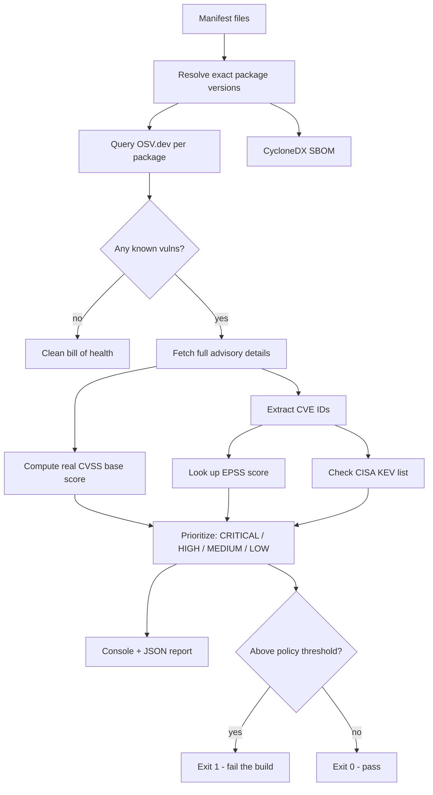

# SupplyChainX

SupplyChainX is a dependency risk scanner. Point it at a project, and instead of just listing every CVE in its dependency tree, it tells you which of those actually matter right now - using real exploitation data, not just severity scores - and generates a standard SBOM alongside it.

The reason I built it this way: running a raw vulnerability scanner against any real project's dependencies tends to produce a wall of CVEs, most of them years old and never exploited in practice. Treating all of them as equally urgent is exactly how real prioritization gets ignored, and how genuinely dangerous ones get lost in the noise. Product security work is as much about triage as it is about detection, so that's what this project focuses on.

## What it does

- Parses a project's actual resolved dependencies (`requirements.txt` pins for Python, `package-lock.json` for Node - not just the version ranges in `package.json`, since ranges don't tell you what's actually installed)
- Checks every package@version against [OSV.dev](https://osv.dev/), a free, open vulnerability database that aggregates GitHub Security Advisories, PyPA advisories, and others
- Computes the real CVSS base score from each advisory's vector string (not just trusting a pre-labeled severity, which isn't always present)
- Cross-references every CVE against [EPSS](https://www.first.org/epss/) - a model that estimates the probability a vulnerability actually gets exploited in the next 30 days - and against [CISA's Known Exploited Vulnerabilities list](https://www.cisa.gov/known-exploited-vulnerabilities-catalog), which is confirmed, observed exploitation rather than a prediction
- Combines all of that into a prioritized CRITICAL/HIGH/MEDIUM/LOW list, where every finding says exactly *why* it landed in that tier
- Generates a CycloneDX SBOM (the standard format most SBOM/vulnerability-management tooling expects)
- Can fail a CI build if anything crosses a configurable policy threshold
- Separately flags copyleft-licensed dependencies (GPL, AGPL, LGPL) - a real legal/compliance risk that has nothing to do with CVEs, and gets missed if a scanner only looks at vulnerabilities

## How it's put together



## Project layout

```
SupplyChainX/
├── src/
│   ├── manifest_parser.py   resolves exact dependency versions from lockfiles
│   ├── cvss.py              computes real CVSS v3.1 base scores from vector strings
│   ├── osv_client.py        queries OSV.dev for known vulnerabilities
│   ├── enrichment.py        EPSS + CISA KEV lookups
│   ├── license_check.py     flags copyleft-licensed dependencies
│   ├── risk_engine.py       the actual prioritization logic
│   ├── sbom.py               CycloneDX SBOM generation
│   ├── report.py             console + JSON reporting
│   └── cli.py                entry point / orchestration
│
├── config/
│   └── policy.json           what tier fails a CI build
│
├── samples/                  real test projects with known-vulnerable pinned deps
├── .github/workflows/        example CI integration
└── requirements.txt
```

## Getting it running

```bash
pip install -r requirements.txt

# scan any project directory with a requirements.txt or package-lock.json
python src/cli.py /path/to/some/project --config config/policy.json
```

It writes `sbom.json` and `report.json` into the scanned project's directory, prints a prioritized summary to the console, and exits non-zero if anything crosses the policy threshold in `config/policy.json`.

## Testing it against real vulnerable projects

I built three small sample projects with real, deliberately outdated pinned dependencies to actually exercise this rather than just trust the code.

**A Python project pinning `django==3.2.0`, `pyyaml==5.3.1`, `requests==2.19.1`, `pillow==8.0.0`, and `flask==0.12.2`** turned up 162 raw vulnerability records from OSV. After de-duplication (the same CVE is often reported under more than one advisory ID - OSV aggregates GitHub Security Advisories and PyPA advisories separately, and they frequently overlap) that came down to 85 distinct findings:

```
Total findings: 85  (CRITICAL=1 HIGH=54 MEDIUM=0 LOW=30)

[CRITICAL]
  pillow@8.0.0 (PyPI) - CVE-2023-4863
    libwebp: OOB write in BuildHuffmanTable
    why: confirmed under active exploitation (CISA KEV)
```

That's the actual point of this tool: 85 known issues in that dependency set, but exactly one of them is confirmed to be under active real-world exploitation. That's the one that gets fixed today; the rest can be triaged normally. A tool that just dumped all 85 as equally severe would bury the one that matters.

**An npm project pinning `lodash@4.17.15` and `minimist@1.2.0`** correctly picked up the well-known prototype-pollution CVEs in both packages (CVE-2020-8203, CVE-2021-23337, CVE-2021-44906), confirming the Node/lockfile parsing path works, not just the Python one.

**The CI-gate logic actually gates.** Running the same Python project against a policy of `fail_on: HIGH` exits with code 1. Running it again against `fail_on: CRITICAL` on identical data exits 0 - only the one KEV-confirmed finding would have blocked a build under a stricter policy, and everything else is left for normal triage rather than blocking anyone's merge.

**A project pinning `pyqt5==5.15.9`** (genuinely GPL v3-licensed, not a hypothetical) correctly got flagged separately from the vulnerability findings:

```
--- License Risk ---
1 copyleft-licensed dependency(ies) - a legal/compliance concern separate from security risk:
  pyqt5@5.15.9 (PyPI) - GPL v3
(1 permissive, 0 unknown/unresolved)
```

That's a real, non-hypothetical example - PyQt5 is dual-licensed (GPL v3 or a paid commercial license), which is exactly the kind of thing that's a genuine problem in a proprietary codebase and invisible to a scanner that only checks for CVEs.

A couple of things worth noting from actually building this:

- OSV's batch endpoint only returns vulnerability IDs, not details - fetching full details for the ~160 unique vulnerabilities one at a time took over two minutes. Since those are independent HTTP calls, fetching them concurrently (20 workers) brought that down to about 34 seconds.
- CVSS vectors from advisories aren't a plain numeric score - they're a string like `CVSS:3.1/AV:N/AC:L/PR:N/UI:N/S:U/C:H/I:H/A:H` that has to be run through the actual CVSS v3.1 base-score formula. I implemented that and checked it against a couple of published reference scores before trusting any output from it.
- Even "recent" packages aren't CVE-free forever - a same-day check of Django's latest release still turned up a few disclosed issues. That's normal and expected, not a bug; it's exactly why a fixed policy threshold matters more than assuming "new version = safe."

## What's next

- Support for more ecosystems (Go modules, Maven/Gradle)
- A way to suppress/accept specific findings with a documented reason, instead of them reappearing on every scan
- Caching OSV/EPSS lookups locally so re-scanning an unchanged dependency tree doesn't re-hit every API

## What this reinforced for me

Severity alone doesn't tell you what to fix first - a CVSS 9.8 that's never been exploited and a CVSS 7.5 that's actively being exploited right now are not the same priority, and a tool that treats them the same isn't actually helping anyone triage. Real-world exploitation data (EPSS, KEV) is what turns a vulnerability list into an actual to-do list. And "shift security left" only means something if the tooling can actually sit in CI and gate a build - a scanner that only produces a report nobody reads isn't shifting anything.
